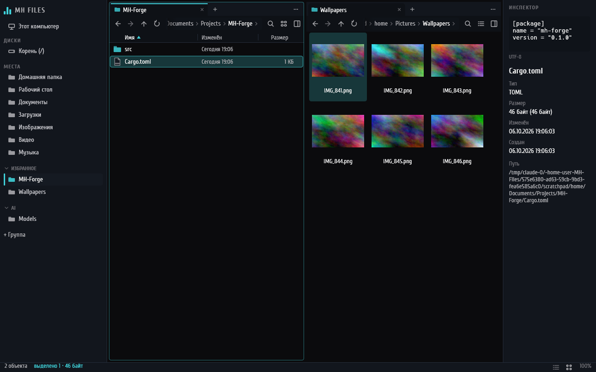
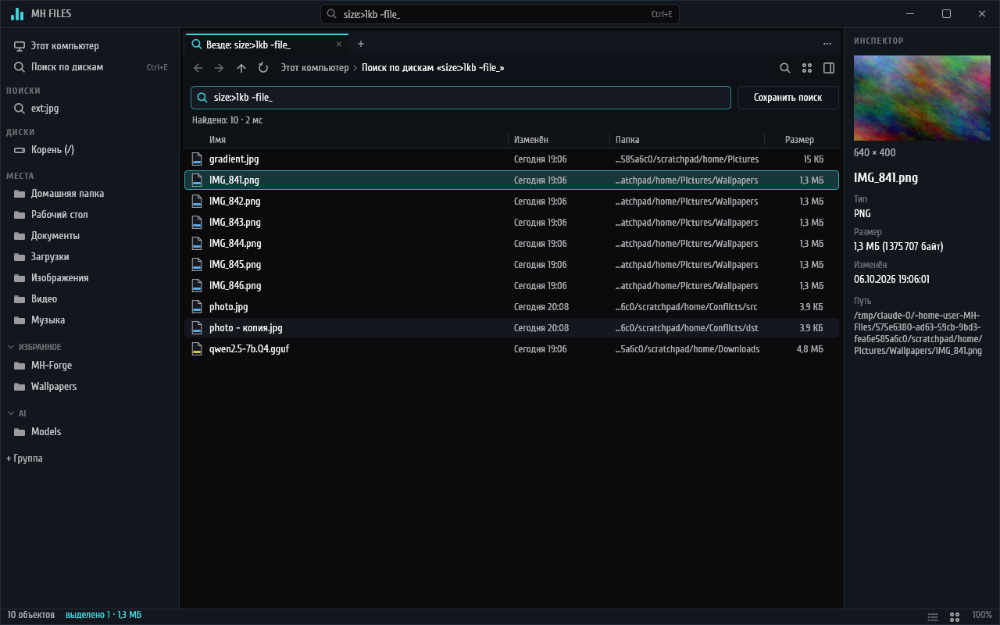
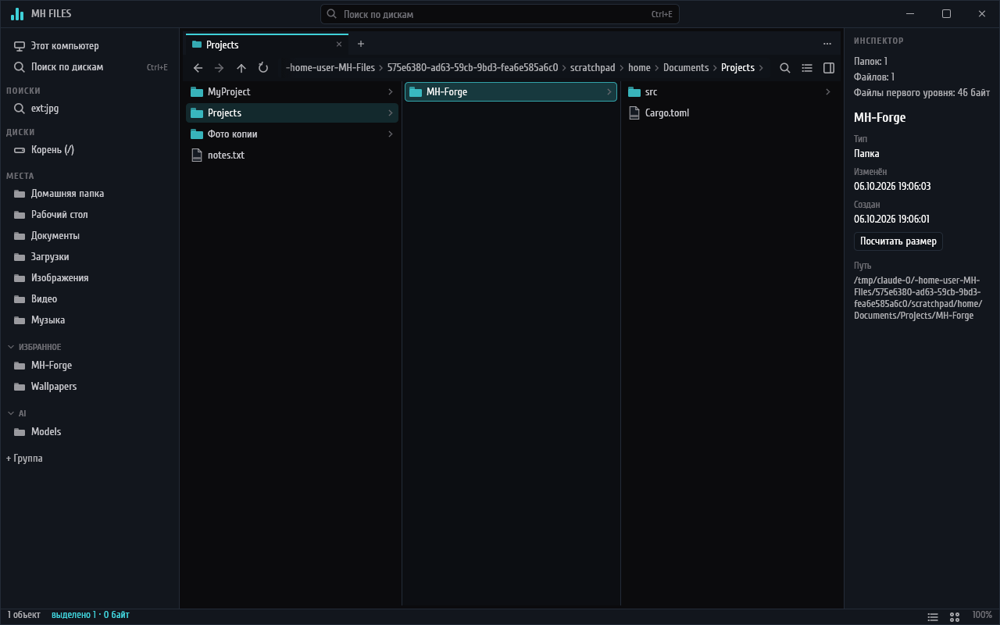
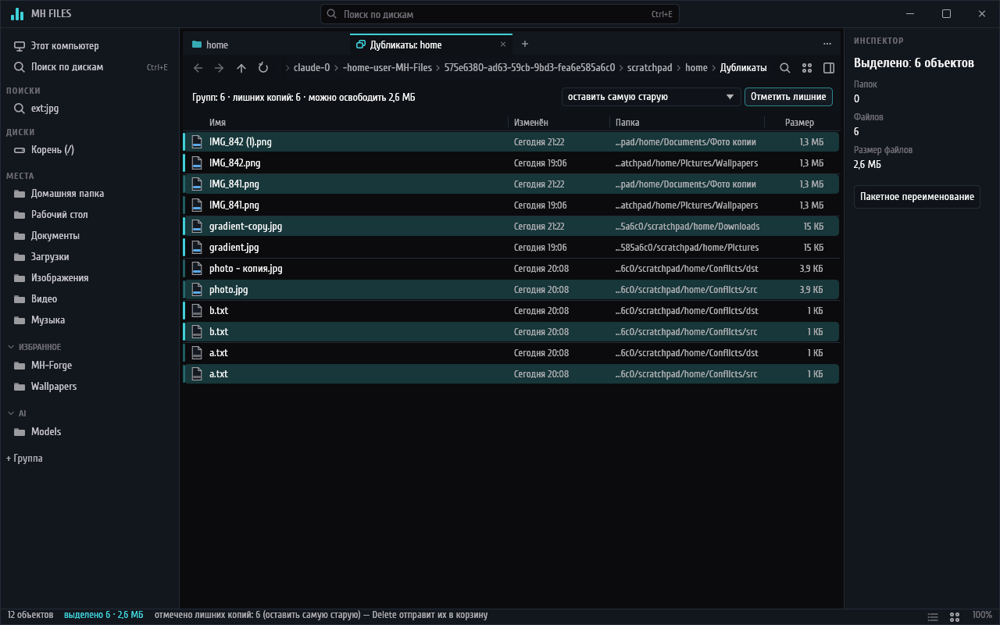
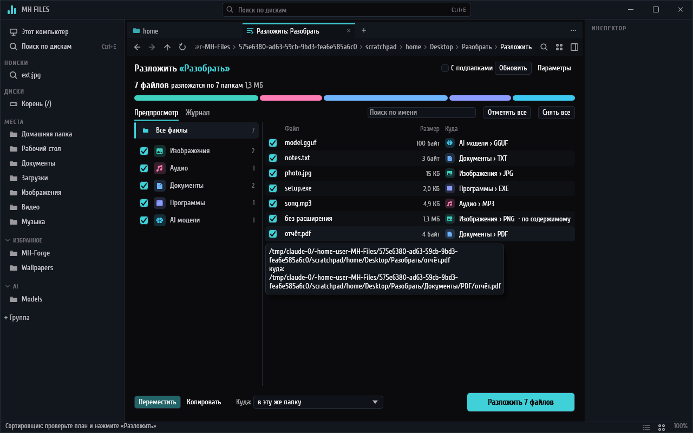

# MH Files

Файловый менеджер для Windows 10/11 на Rust: скорость и управление в духе File Pilot,
технические идеи OneCommander и визуальный язык
[MH Monitoring](https://github.com/midnightheartsgames/MH-Monitoring) и
[MH Sidebar](https://github.com/midnightheartsgames/MH-Sidebar). Один `.exe`, без
Electron/WebView и фоновых служб.



## Возможности

* Панели делятся в любую сторону, у каждой свои вкладки; сеанс восстанавливается.
* Таблица и плитки с эскизами, «Этот компьютер» с заполнением дисков.
* Боковая панель: диски, известные папки, свои группы избранного.
* Строка пути со списком подпапок, ввод пути с `%переменными%`.
* Инспектор: картинки, текст, сведения; быстрый просмотр по пробелу.
* Палитра команд (Ctrl+Shift+P), GoTo (Ctrl+G), фильтр (Ctrl+F), поиск во вложенных папках
  (Ctrl+Shift+F).
* Пакетное переименование с правилами, переменными и проверкой имён Windows.
* Копирование, перемещение, корзина, конфликты и UAC — через Windows Shell (`IFileOperation`);
  буфер обмена совместим с Проводником; перетаскивание между панелями и из Проводника.
* Горячие клавиши настраиваются; окно настроек в стиле MH Monitoring.
* Папки на 100 000 файлов прокручиваются без задержек: список виртуальный, чтение потоковое.

## Добавлено в 0.2

* Своя панель операций: прогресс, пауза, отмена; свой диалог конфликтов имён.
* «Отменить» (Ctrl+Z) для переименования, перемещения, копирования, новой папки и пакетного
  переименования.
* Меню Windows с пунктами 7-Zip, Git и других программ (Shift+F10).
* Перетаскивание файлов из MH Files в Проводник и другие программы.
* Размеры папок по запросу (Ctrl+Shift+S), с сортировкой.
* Выделение рамкой, перетаскивание вкладок между панелями и в край панели.
* Последовательности клавиш: Alt+G, затем D — «Загрузки», H — домой и т. д.
* Операции с путями длиннее 260 символов.

## Добавлено в 0.3



* Поиск по всем дискам за миллисекунды (Ctrl+E): индекс имён в памяти, снимок на диске,
  обновление на лету. Запросы: `отчёт -черновик`, `*.psd`, `ext:mp4 size:>1gb`,
  `dm:неделя`, `type:папка`, `in:"C:\Проекты"`, `hidden:да`.
* Сохранённые поиски в боковой панели.
* Настройки индекса: какие диски и папки, исключения, пересканирование.
* Свой заголовок окна в стиле MH со строкой поиска (отключается в настройках).

## Добавлено в 0.4



* Вид «Колонки» (Ctrl+3): родительские папки слева, содержимое папки под курсором справа,
  стрелки ←/→ ходят по дереву.
* Архивы zip и 7z открываются как папки: предпросмотр внутри, «Извлечь…» (Ctrl+Shift+E),
  перетаскивание из архива, Ctrl+C из архива.
* Поиск дубликатов с отметкой лишних копий и подсчётом, сколько места освободится.
* В Инспекторе — страницы PDF, свойства видео, музыки и фото, документы Office через
  обработчики предпросмотра Windows.



## Добавлено в 0.5



* Сортировщик из [MH Sort](https://github.com/midnightheartsgames/MH-Sort) прямо в проводнике
  (Ctrl+Shift+O): раскладывает папку по категориям и типам (`Видео\MP4`) с предпросмотром,
  галочками по файлам и категориям, перемещением или копированием, отменой по журналу и
  Ctrl+Z. `categories.json` — того же формата, категории MH Sort подхватываются сами.
* Категории правятся прямо в «Настройки → Сортировка»: имя папки, расширения, порядок,
  проверка, куда попадёт файл с данным именем.

## Добавлено в 1.0

* Установщик для текущего пользователя (без прав администратора) и переносная версия:
  положите рядом с `MH-Files.exe` пустой файл `portable` — настройки и индекс будут в папке
  `data` рядом.
* Одна копия программы: путь из ярлыка, `cmd` или Проводника открывается вкладкой в уже
  открытом окне. `--new-window` — отдельное окно.
* «Открыть в MH Files» в меню папок, дисков и пустого места Проводника (галочка установщика
  или «Настройки → Система»).
* Командная строка: `MH-Files.exe [--new-window] [--portable] [путь…]`; путь к файлу
  открывает его папку и выделяет файл.
* Настройки прошлой версии сохраняются в `backup\<версия>` при обновлении; после сбоя
  вкладки восстанавливаются, отчёт о сбое — в «Настройки → Система».

## Добавлено после 1.0.0-rc.1

* Проверка обновлений по кнопке в «О программе» — один запрос к GitHub Releases.
* «Открывать папки в MH Files» вместо Проводника и MH Files в «Открыть с помощью» для zip,
  7z и rar — галочками в «Настройки › Система» (`Win+E` остаётся за Проводником).
* Архив в архиве открывается как папка; rar — через 7-Zip или `tar.exe` Windows 11; файлы
  можно бросать в zip — его дописывает Проводник.
* Видео и музыка играют прямо в быстром просмотре (пробел): Enter — пауза, Shift+стрелки —
  перемотка.
* Поиск по содержимому текстовых файлов (Ctrl+Alt+F), съёмные и сетевые диски в поиске по
  дискам, у администратора — первый индекс диска из MFT за секунды.
* Дубликаты: порог размера, исключения, «Жёсткие ссылки вместо копий».
* Сортировщик: правила «старше года — в Архив», «больше 4 ГБ — в Большие», раскладка папки
  по расписанию, файл можно перетащить на другую категорию в плане.
* Ctrl+Z возвращает удалённое в корзину; перетаскивание правой кнопкой с меню «Копировать /
  Переместить / Создать ярлыки»; Snap Layouts Windows 11 у своего заголовка окна.

Версия `1.0.0-rc.1` — выпуск-кандидат: `1.0.0` выйдет после полной проверки на Windows
(PLAN.md §7).

Подробности, архитектура, правила проекта и планы — в [PLAN.md](PLAN.md).

## Установка

Со страницы [Releases](https://github.com/midnightheartsgames/MH-Files/releases), из артефакта CI
(`release`) или `tools\build-release.ps1`:

* `MH-Files-<версия>-setup.exe` — установка в `%LOCALAPPDATA%\Programs\MH Files`, без UAC;
* `MH-Files-<версия>-portable.zip` — распаковать куда угодно, хоть на флешку.

Пока у проекта нет сертификата, установщик не подписан: SmartScreen при первом запуске
предупредит — «Подробнее › Выполнить в любом случае». Сборка подписывается сама, когда
сертификат задан (PLAN.md §11).

## Сборка

```
cargo build --release
```

На Windows (MSVC) получается `target\release\MH-Files.exe` со значком, версией и манифестом
(длинные пути, PerMonitorV2). Под Linux программа собирается и запускается для разработки и
тестов — с упрощёнными заглушками вместо Windows Shell.

Установщик и переносной zip: `.\tools\build-release.ps1` (для установщика нужен
[Inno Setup 6](https://jrsoftware.org/isinfo.php)), результат — в `target\dist`.

Проверки, как в CI:

```
cargo fmt --all --check
cargo clippy --workspace --all-targets --locked -- -D warnings
cargo test --workspace --locked
cargo check --workspace --target x86_64-pc-windows-gnu
```

## Устройство

| Крейт | Что внутри |
|---|---|
| `crates/core` | модель без ввода-вывода: список, выделение, история, раскладка, сортировка, переименование, индекс тома и язык запросов, настройки |
| `crates/fs` | фоновые воркеры: чтение папок, поиск, служба индекса дисков, архивы, дубликаты, предпросмотр, эскизы, наблюдение |
| `crates/platform` | Windows Shell, COM и Win32 за безопасным API |
| `crates/ui` | интерфейс на eframe/egui, `MH-Files.exe` |

Настройки, сеанс, категории сортировщика и его журналы, отчёты о сбоях: `%APPDATA%\MH Files\`, снимки индекса: `%LOCALAPPDATA%\MH Files\index\`; в переносном режиме всё — в `data` рядом с exe.

## Лицензия

MIT. Шрифт Cuprum — SIL Open Font License 1.1 (`assets/fonts/OFL.txt`).
