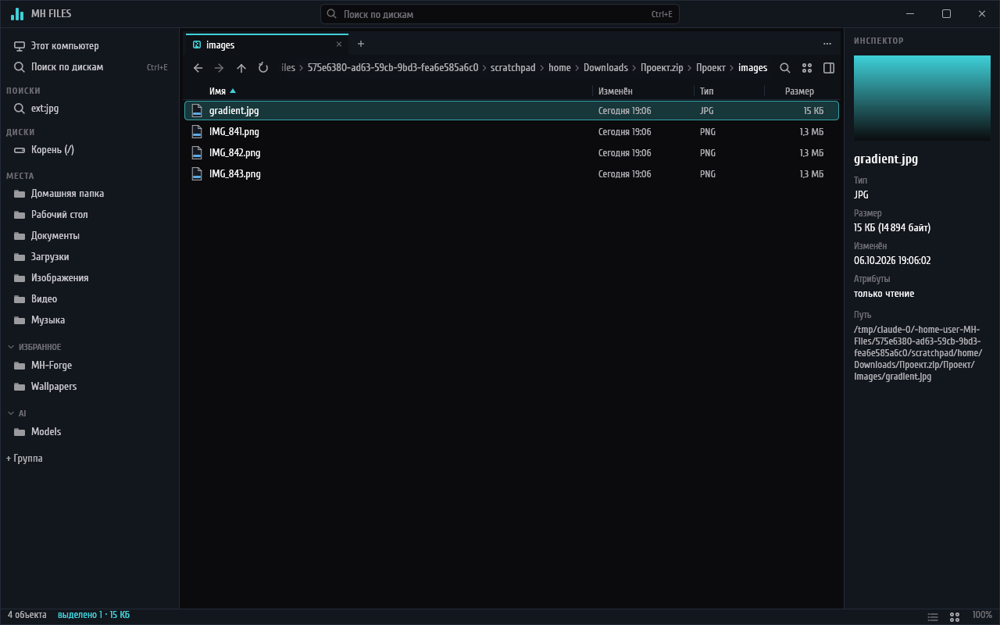

# MH Files

Файловый менеджер для Windows 10/11 на Rust: скорость и управление в духе File Pilot,
технические идеи OneCommander и визуальный язык
[MH Monitoring](https://github.com/midnightheartsgames/MH-Monitoring) и
[MH Sidebar](https://github.com/midnightheartsgames/MH-Sidebar). Один `.exe`, без
Electron/WebView и фоновых служб.


## Возможности

### Окно и навигация

* Панели делятся в любую сторону, у каждой свои вкладки; вкладку можно перетащить в другую
  панель или на её край, папку — на край окна, и она откроется новой панелью. Сеанс
  восстанавливается при запуске; закрыли последнюю вкладку — на её месте «Этот компьютер».
* Три вида: таблица, плитки с эскизами и «Колонки» (Ctrl+3) — родительские папки слева,
  содержимое под курсором справа. Ctrl+колесо мыши меняет размер плиток и строк.
* Боковая панель: диски с заполнением (флешки появляются и пропадают сами), «Корзина»,
  известные папки, свои группы избранного, сохранённые поиски.
* Строка пути со списком подпапок у каждого звена, ввод пути с `%переменными%`; кнопки
  «Новая папка» и «Новый текстовый файл».
* Палитра команд (Ctrl+Shift+P), GoTo (Ctrl+G), фильтр папки (Ctrl+F), последовательности
  клавиш (Alt+G, затем D — «Загрузки», H — домой). Все клавиши настраиваются.
* Свой заголовок окна в стиле MH со строкой поиска и Snap Layouts Windows 11 (отключается).
* Папки на 100 000 файлов прокручиваются без задержек: список виртуальный, чтение потоковое.

### Файлы

* Копирование, перемещение, корзина, конфликты и UAC — через Windows Shell
  (`IFileOperation`); своя панель операций с прогрессом, паузой и отменой, свой диалог
  конфликтов имён. Пути длиннее 260 символов тоже.
* «Отменить» (Ctrl+Z): переименование, перемещение, копирование, новые файлы и папки,
  пакетное переименование, удаление в корзину.
* Перетаскивание между панелями, из Проводника и с рабочего стола, из MH Files в другие
  программы; правой кнопкой — меню «Копировать / Переместить / Создать ярлыки». Подсказка у
  курсора говорит, что произойдёт.
* Буфер обмена совместим с Проводником.
* Контекстное меню со своими командами и пунктами Проводника и программ (7-Zip, Git,
  PowerToys, «Отправить», «Открыть с помощью») — со значками, без повторов; большое меню
  выходит за край окна, как в Проводнике. Полное меню Windows — Shift+F10.
* Пакетное переименование с правилами, переменными и проверкой имён Windows; переименование
  вторым щелчком по имени.
* Цветные метки: правый щелчок › «Цвет» — шесть цветов, рамка вокруг значка или эскиза.
* Корзина открывается вкладкой: откуда и когда удалено, «Восстановить», «Удалить насовсем»,
  «Очистить корзину».
* Размеры папок: в списке — сразу из индекса поиска, в Инспекторе — сам; по запросу —
  Ctrl+Shift+S, с сортировкой. Цветной кружок давности у дат изменения.

### Просмотр

* Инспектор (Alt+P): картинки и SVG, текст, страницы PDF, шрифты (образцы на языках
  раскладок клавиатуры), свойства видео, музыки и фото, документы Office через обработчики
  предпросмотра Windows.
* Быстрый просмотр по пробелу; видео и музыка играют прямо в нём (Enter — пауза,
  Shift+стрелки — перемотка), у звука — эквалайзер и обложка, громкость запоминается.
* Эскизы в плитках — у картинок и у всех типов, для которых программы регистрируют эскизы
  в Windows (например, .blend у Blender).

### Поиск


* Поиск по всем дискам за миллисекунды (Ctrl+E): индекс имён в памяти, снимок на диске,
  обновление на лету; съёмные и сетевые диски тоже, у администратора первый индекс диска
  строится из MFT за секунды. Запросы: `отчёт -черновик`, `*.psd`, `ext:mp4 size:>1gb`,
  `dm:неделя`, `type:папка`, `in:"C:\Проекты"`, `hidden:да`.
* Поиск во вложенных папках (Ctrl+Shift+F) и по содержимому текстовых файлов (Ctrl+Alt+F).
* Сохранённые поиски в боковой панели; какие диски и папки индексировать, исключения и
  пересканирование — в настройках.

### Архивы



* zip, 7z и rar открываются как папки, архив в архиве — тоже; rar — через 7-Zip или
  `tar.exe` Windows 11. Предпросмотр внутри, «Извлечь…» (Ctrl+Shift+E), перетаскивание и
  Ctrl+C из архива.
* Файлы бросаются в zip — на файл архива или в открытый архив: MH Files дописывает его сам,
  на копии, занятые имена не перезаписываются.

### Дубликаты и сортировщик


* Поиск дубликатов с отметкой лишних копий и подсчётом, сколько места освободится; порог
  размера, исключения, «Жёсткие ссылки вместо копий».


* Сортировщик из [MH Sort](https://github.com/midnightheartsgames/MH-Sort) прямо в проводнике
  (Ctrl+Shift+O): раскладывает папку по категориям и типам (`Видео\MP4`) с предпросмотром,
  галочками по файлам и категориям, перемещением или копированием, отменой по журналу.
  Правила «старше года — в Архив», «больше 4 ГБ — в Большие», раскладка по расписанию.
* Категории правятся в «Настройки › Сортировка»; `categories.json` — того же формата, что у
  MH Sort, его категории подхватываются сами.


### Встраивание в Windows

* Одна копия программы: путь из ярлыка, `cmd` или Проводника открывается вкладкой в уже
  открытом окне; `--new-window` — отдельное окно.
* «Открыть в MH Files» в меню папок, дисков и пустого места Проводника; «Открывать папки в
  MH Files» вместо Проводника; MH Files в «Открыть с помощью» для zip, 7z и rar — галочками в
  «Настройки › Система» (`Win+E` остаётся за Проводником).
* Командная строка: `MH-Files.exe [--new-window] [--portable] [путь…]`; путь к файлу
  открывает его папку и выделяет файл.
* Проверка обновлений по кнопке в «О программе» — один запрос к GitHub Releases.
* Настройки прошлой версии сохраняются в `backup\<версия>` при обновлении; после сбоя
  вкладки восстанавливаются, отчёт о сбое — в «Настройки › Система».

Подробности, архитектура, правила проекта и планы — в [PLAN.md](PLAN.md).

## Горячие клавиши

| Действие | Клавиши |
|---|---|
| Палитра команд / GoTo / ввод пути | Ctrl+Shift+P / Ctrl+G / Ctrl+L |
| Фильтр / поиск во вложенных / по содержимому | Ctrl+F / Ctrl+Shift+F / Ctrl+Alt+F |
| Поиск по дискам | Ctrl+E |
| Таблица / плитки / колонки | Ctrl+1 / Ctrl+2 / Ctrl+3 |
| Быстрый просмотр | Пробел |
| Переименовать / пакетно | F2 / Ctrl+Shift+R |
| В корзину / насовсем | Delete / Shift+Delete |
| Новая папка / новый текстовый файл | Ctrl+Shift+N / Ctrl+Alt+N |
| Отменить | Ctrl+Z |
| Новая / закрыть / вернуть вкладку | Ctrl+T / Ctrl+W / Ctrl+Alt+T |
| Разделить справа / снизу | Ctrl+\ / Ctrl+Shift+\ |
| Инспектор / боковая панель | Alt+P / Ctrl+B |
| Извлечь из архива / разложить по папкам | Ctrl+Shift+E / Ctrl+Shift+O |
| Меню Windows / терминал здесь | Shift+F10 / Ctrl+Shift+T |
| Настройки | Ctrl+, |

Полный список — в палитре команд и в «Настройки › Клавиши».

## Установка

Со страницы [Releases](https://github.com/midnightheartsgames/MH-Files/releases):

* `MH-Files-<версия>-setup.exe` — установка в `%LOCALAPPDATA%\Programs\MH Files`, без прав
  администратора; поверх прежней версии ставится как обновление.
* `MH-Files-<версия>-portable.zip` — распаковать куда угодно, хоть на флешку: настройки и
  индекс хранятся в папке `data` рядом с exe (переносной режим включает пустой файл
  `portable` рядом с `MH-Files.exe`).
* `SHA256SUMS.txt` — контрольные суммы.

Пока у проекта нет сертификата, установщик не подписан: SmartScreen при первом запуске
предупредит — «Подробнее › Выполнить в любом случае». Сборка подписывается сама, когда
сертификат задан (PLAN.md §11).

## Сборка

```
cargo build --release
```

На Windows (MSVC) получается `target\release\MH-Files.exe` со значком, версией и манифестом
(длинные пути, PerMonitorV2). Под Linux программа собирается и запускается для разработки и
тестов — с упрощёнными заглушками вместо Windows Shell.

Установщик и переносной zip: `.\tools\build-release.ps1` (для установщика нужен
[Inno Setup 6](https://jrsoftware.org/isinfo.php)), результат — в `target\dist`. Значок
собирает `tools/make-icon.py`.

Проверки, как в CI:

```
cargo fmt --all --check
cargo clippy --workspace --all-targets --locked -- -D warnings
cargo test --workspace --locked
cargo check --workspace --target x86_64-pc-windows-gnu
```

## Устройство

| Крейт | Что внутри |
|---|---|
| `crates/core` | модель без ввода-вывода: список, выделение, история, раскладка, сортировка, переименование, индекс тома и язык запросов, настройки, метки |
| `crates/fs` | фоновые воркеры: чтение папок, поиск, служба индекса дисков, архивы, дубликаты, предпросмотр, эскизы, наблюдение, корзина |
| `crates/platform` | Windows Shell, COM, Win32 и Media Foundation за безопасным API |
| `crates/ui` | интерфейс на eframe/egui, `MH-Files.exe` |

Настройки, сеанс, метки, категории сортировщика и его журналы, отчёты о сбоях:
`%APPDATA%\MH Files\`, снимки индекса: `%LOCALAPPDATA%\MH Files\index\`; в переносном режиме
всё — в `data` рядом с exe.

## Лицензия

MIT. Шрифт Cuprum — SIL Open Font License 1.1 (`assets/fonts/OFL.txt`).
